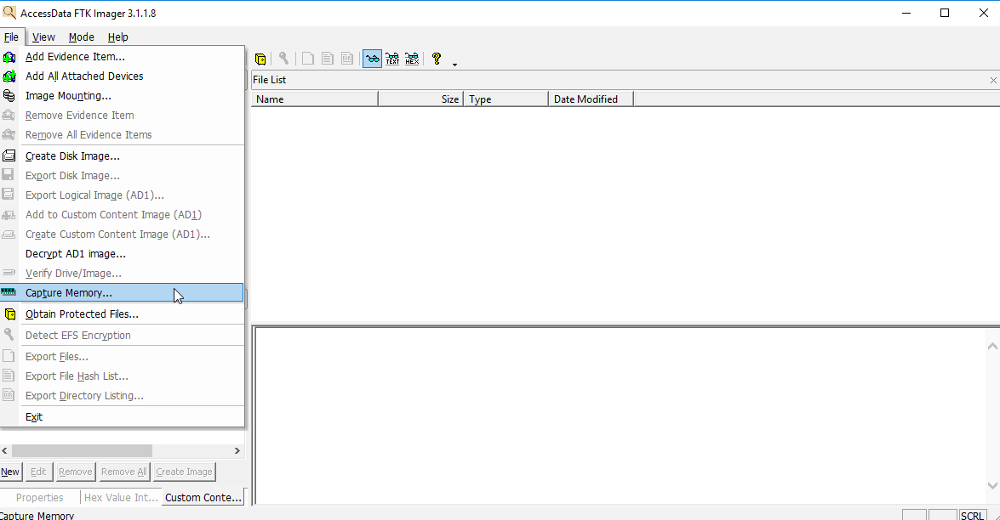

# Acquisition Method

## Memory Acquisition \(FTK Imager Lite\)

File &gt; Capture Memory



## FastBloc SE

1. Make sure no devices are attached \(or only your storage device is attached\)
2. Tools &gt; FastBloc SE &gt; Write Blocked
3. Attach the target device to the system
4. In EnCase, either create a new case or open an existing one
5. Add Evidence &gt; Add Local Device
6. On the page that follows, accept the defaults and click Next. On the screen that follows, you will see a dot or Yes in the Write Blocked column, and the icon for the device will have a green box around it, both indicating a successful write block.
7. Select the write-blocked target device \(blue check\) &gt; Finish &gt; double click the evidence &gt; Acquire


Write Block = writes are prevented but are cached locally to prevent Windows error messages Write Protect = writes are prevented, nothing is cached locally, and Windows launches error messages when writes are attempted


After finished acquiring &gt; Physically remove the device &gt; Stop the write-blocking software in EnCase \(Tools &gt; FastBloc SE &gt; Clear All\)

## Tableau Write Blocker

## LinEn \(Linux\)


Edit the inittab file with text editor to change your Linux \(e.g. Helix\) to console mode By change `id:5:initdefault:.` to `id:3:initdefault:.`


1. Attached the target drive to the Linux imaging platform
2. Attached storage drive \(FAT32\) to the Linux imaging platform
3. Boot your Linux machine to console and log in as root
4. Check what file systems are mounted

   ```bash
   mount
   ```

5. Check what devices are available

   ```text
   fdisk -l
   ```

6. Mount your storage drive and check that the storage drive is mounted

   ```text
   mkdir /mnt/fat32
   mount /dev/hda1 /mnt/fat32
   mount
   ```

7. Create the folder on your storage volume to hold the EnCase evidence file
8. Go to the directory of LinEn and run LinEn

   ```text
   ./LinEn
   ```

9. press `A` / use Tab key to go to Acquire and press Enter
10. Select your drive and press Enter
11. Choose the path for your evidence file and prefix it with the path to the mount path e.g. `/case/casename/evidence` to `/mnt/winfat/cases/casename/evidence/XXX001`

## Guymager (Caine OS)

1. Insert the CAINE OS USB into the target machine. Boot from BIOS (F2). Select the USB as the boot drive
2. After startup, connect storage harddisk to the target machine
3. Mount storage harddisk

```text
$ ls /media
$ ls /media/sdc2
$ sudo mount /dev/sdc2 -rw
$ ls /media/sdc2
```
4. Open guymager and select Calculate MD5 and Verify image after acquisition (takes twice as long) 
5. click Start
