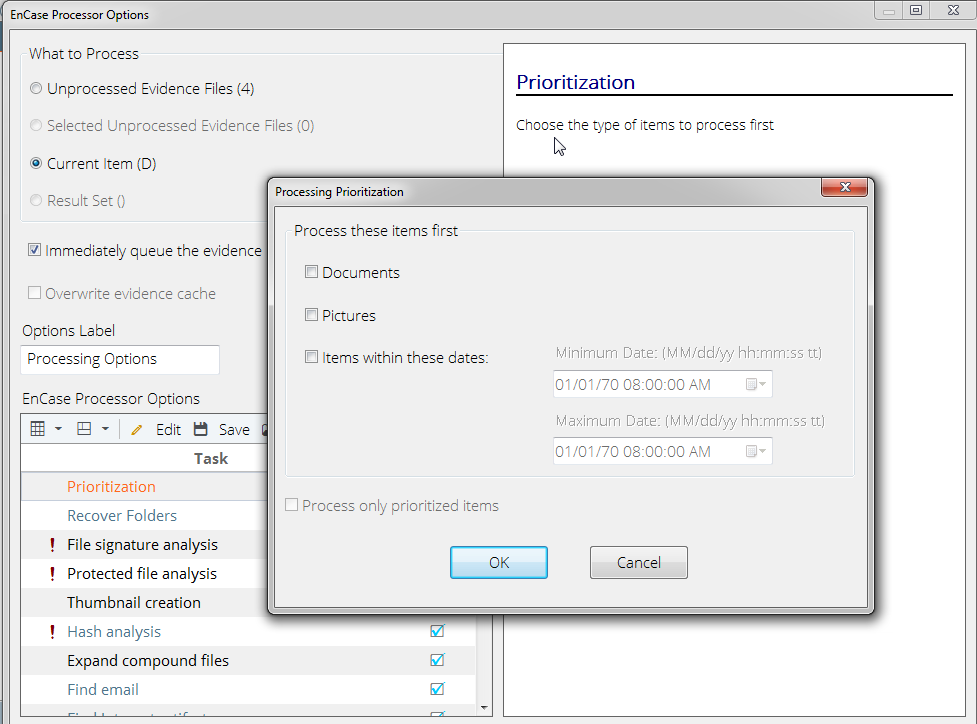

# Basic EnCase

## Creating a Case

* **Templates**: has an extension of .CaseTemplate and is stored in the Users\Documents\EnCase\Templates folder.
* Case information items with default values
* Bookmark folders and notes
* Tag names
* Report template
* User-defined report styles
* **Base Case Folder**: By default, your cases will be stored in your Documents or My Documents folder.
* **Primary Evidence Cache** : When EnCase loads an evidence item for viewing, it parses and stores metadata associated with that evidence item. Each acquired evidence item is assigned a GUID, and a folder by that GUID name will contain the cached data associated with that evidence item.
* **Secondary Evidence Cache**: This location is for previously created caches
* **Case Info**: several fields into which you can or should enter data pertaining to the case. The fields will vary according to the template you select in Templates

### EnCase Folder Structure

* EnCase creates subfolders called Email, Export, Tags, and Temp. 
* User need to manually created Evidence and EvidenceCache.

## EnCase View

Placeholder

## Verify Evidence

Evidence tab &gt; drop down menu &gt; Verify File Integrity &gt; File Integrity/ MD5/SHA-1 / CRC Errors

_Note: Add Evidence will automatically verify the new evidence file added to the case, also reopening the case will verify the evidence files which is not verified yet._

## Timeline view

Tree Pane &gt; Set Included &gt; Timeline view &gt; Higher Resolution or Lower Resolution

Date Types &gt; select which timestamps to be viewed

## Sort

First sort \(either one of the following\):

* Open sort menu from Table toolbar
* Double click the header of the column you want to sort

Second sort:

* Hold down the Shirt key &gt; double click the column header

Sort in opposite direction:

* CTRL + double click column header
* CTRL + SHIFT + double click the column header

Remove Sort:

* Remove sort in the Sort menu
* Double click

## Gallery view

* See images -&gt; Set Include Folders button in the Tree pane, you can direct the content of the Table pane
* EnCase displays images based on the file extension. After the file signature analysis has been completed, the files will display based on their file header information.

## Disk view

* Evidence tab -&gt; Place the cursor on device -&gt; Device -&gt; Disk View
* By default, you see a series of colored square blocks, each representing one sector. If you would prefer that each block represent a cluster, simply click the check box next to View Clusters on the toolbar for this view. 
* Blue blocks are allocated sectors or clusters. 
* The gray blocks with the raised bump in the center are unallocated sectors or clusters. 
* Go to a sector by typing in the sector number -&gt; Go To feature from its menu on the Disk View toolbar

## File Types view

* Add File Type View &gt; File Types &gt; New
* Add a File Viewer Open With &gt; File Viewers &gt; New File Viewer

## Evidence Processor

* Prioritization

* Recover Folders

When you turn on the Recover folder structure of NTFS 3.0 files option, recovery will take longer, but will reconstruct \(folder tree\); if you left that unchecked, all found folders will be grouped together without tree structure.

* Hash Analysis
* File Signatures Analysis
* Finding Email
* Finding Internet Artifacts
* Search Keywords
* Index text and metadata
* System Info Parser
* Windows Artifact Parser
* Snapshot – \(Live preview of devices only\) – Running processes, open ports, logged on users, etc.

<table>
  <thead>
    <tr>
      <th style="text-align:left"></th>
      <th style="text-align:left"></th>
    </tr>
  </thead>
  <tbody>
    <tr>
      <td style="text-align:left">Recover folders</td>
      <td style="text-align:left">&#x2013; Recover files that have been deleted or corrupted on FAT and
        NTFS volumes</td>
    </tr>
    <tr>
      <td style="text-align:left">File signature analysis</td>
      <td style="text-align:left">Determine if the extension of a file has been altered and whether or not
        the extension matches the file type as specified by the file&#x2019;s header</td>
    </tr>
    <tr>
      <td style="text-align:left">Protected file analysis</td>
      <td style="text-align:left">Identify encrypted and password-protected files with the Passware Encryption
        Analyzer</td>
    </tr>
    <tr>
      <td style="text-align:left">Thumbnail creation</td>
      <td style="text-align:left">Creates image thumbnails for faster display in the EnCase&#xAE; GUI</td>
    </tr>
    <tr>
      <td style="text-align:left">Hash analysis</td>
      <td style="text-align:left">Generate MD5 and/or SHA1 hash values for files and compare against your
        case Hash Library</td>
    </tr>
    <tr>
      <td style="text-align:left">Expand compound files</td>
      <td style="text-align:left">Expand compound and compressed files, such as ZIP, RAR, GZIP, TAR, THUMBS.DB,
        CLOOP, and BZIP2</td>
    </tr>
    <tr>
      <td style="text-align:left">Find email</td>
      <td style="text-align:left">Extract individual messages from e-mail archive files, such as PST (Microsoft&#xAE;
        Outlook), NSF (Lotus&#xAE; Notes), DBX (Microsoft&#xAE; Outlook Express),
        EDB (Microsoft&#xAE; Exchange), AOL, MBOX, and EMLX (Macintosh).</td>
    </tr>
    <tr>
      <td style="text-align:left">Find Internet artifacts</td>
      <td style="text-align:left">Collect Internet-related artifacts, such as browser histories and cached
        web pages. You also have the option to search unallocated space for the
        Internet artifacts.</td>
    </tr>
    <tr>
      <td style="text-align:left">Search for keywords</td>
      <td style="text-align:left">Search raw (not transcript) text for specific keywords.</td>
    </tr>
    <tr>
      <td style="text-align:left">Index text and metadata</td>
      <td style="text-align:left">Create an index for when you need to search for keywords in compound files
        (Microsoft Office 2007 and 2010) and across large amounts of data. You
        can adjust the parameters for index creation, such as the minimum word
        length to index and whether to use a noise file (which does not index specific
        and common words).</td>
    </tr>
    <tr>
      <td style="text-align:left">System Info Parser</td>
      <td style="text-align:left">
        
Report on the core system information for Linux and Windows, including:

        
Startup routine (Linux only)

        
User activity (Linux only)

        
Operating system

        
Hardware

        
Software

        
Accounts/users

        
Network information

        
Shared/mapped drives

        
USB Devices

        
Network Shares

        
Advanced : Windows Registry

        
Time zone setting

        
Auto start

        
Hardware

        
User activity

        
User defined keys

        
Network Shares

        
Other AutoRuns

      </td>
    </tr>
    <tr>
      <td style="text-align:left">Windows Artifact Parser</td>
      <td style="text-align:left">
        
Report on Windows artifacts, including Link files Recycle Bin files MFT
          (NTFS Master File Table) transactions

        
Option: All or selected files, and/or unallocated clusters

      </td>
    </tr>
    <tr>
      <td style="text-align:left">Snapshot (Live preview of devices only)</td>
      <td style="text-align:left">Running processes, open ports, logged on users, etc.</td>
    </tr>
  </tbody>
</table>

   –   –   –   –   –   – 

 –   –   – 

 – 

 – 

–

## File Signature Analysis

### Create a new file signatures

### Running File Signature Analysis against Selected Files

| extension | header | Header in Table | Extension | Signature | Signature Analysis |
| :--- | :--- | :--- | :--- | :--- | :--- |
|  |  |  |  |  |  |

### File Signature Analysis

