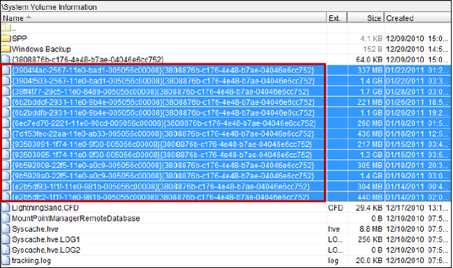

# Volume Shadow Copy

Vista/Win7/Win8 now logs changes to the entire Volume and keeps track of the specific clusters that are changed on a daily basis in the new Volume Snapshot Service or VSS.

Vista/Win7 Business, Enterprise, and Ultimate have Shadow Copy enabled by default.

Enables a user to:

* Revert the file to any previous version 
* Restore a previous version from backup 
* Make a copy of previous version 

All volume shadow copy files are stored in the ‘System Volume Information’ folder on the root of the volume and are recognizable by their names.

The number _**3808876b-c176-4e48-b7ae-04046e6cc752**_, is a unique identifier specific to the volume shadow service.



## System Snapshot Frequency

### Windows Vista,

The system snapshot is scheduled to take place every _**24 hours**_.

### Windows 7

The system snapshot is scheduled to take place every _**7 days**_.

You may notice that this is not exact. Windows Vista will not take volume snapshots exactly every 24 hours; there may be some time changes day to day. This is because the VSS will create new shadow copies only once the computer has been idle for a certain amount of time, or the computer is being turned off or rebooted.

## Tools that can parse the volume shadow copy are:

### Magnet forensics IEF

### VSC-Toolset



### libvshadow \(SIFT\)



### ShadowExplorer



## VSS Imaging

### FTK Imager

```text
[File] -> [Add Evidence Item] -> [Contents of a Folder]
```


### robocopy

```text
C:\> robocopy C:\VSC1\Users\[xxx] F:\VSC1 /S /XJ /COPY:DAT /NFL /NDL /w:0 /r:0
```

```text
/S: Copy subdirectory except empty directory
/XJ: The intersection is not copied
/COPY:DAT: Copy data, attributes and time information (D = Data, A = Attributes, T = Timestamps)
/NFL: Do not log file list
/NDL: Do not log directory listing
/ w: 0: wait time while trying again
/ r: 0: Retry count for failed copy
```

Copy only specific file types \(robocopy\)

```text
C:\> robocopy C:\VSC1\Users F:\VSC1 *.jpg *.bmp *.png /S /XJ /COPY:DAT /NFL /NDL /w:0 /r:0
```

### VSS Live Examination

Obtain a list of existing shadow volumes in the Volume Shadow Copy Service by executing the tool vssadmin.

To obtain a list of the shadows execute:

```text
C:\> vssadmin list shadows /for=C:
```

To create a symbolic link via mklink to mount the shadow copy to a directory of your choice:

```text
mklink /D [target directory] [Shadow Copy Volume]
```

The shadow copy—a mirror of the volume’s entire file system at the time of the snapshot—will now be available within the linked directory.

This command will list the available shadows for the C-drive volume.

Things to notice:

The shadow copy volume is the name of the volume that we will use to examine the contents of that specific volume. You might want to write the exact name down.

The originating machine would be noteworthy if you have plugged in an NTFS drive from another shadow copy-enabled machine.

The system time of the creation time of the volume will tell you when the snapshot was created, This time is important as you know which shadow copy volume might contain your data. From the output of vssadmin, note the total number of shadow copy volumes from the machine

Live examination of VSS

* vssadmin + mslink + robocopy 
* FTK Imager, EnCase 
* ShadowExplorer, VSCToolset, ShadowKit

  Offline analysis

* Reconnoitre – Commercial
* libvshadow \(DD style RAW image input for use on Linux / Mac\)

Offline Analysis

1. Mount disk image in Arsenal Image Mounter in “Write Temporary“ Mode
2. Launch ShadowExplorer as Administrator
3. Browse Snapshots
4. Extract Files using Right Click -&gt; Export  


 


