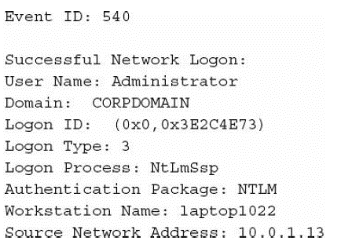
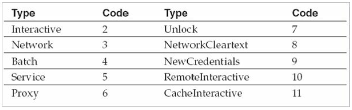

# Windows Event Logs

Each log is stored in a separate file in paths specified within registry key

```text
HKEY_LOCAL_MACHINE\SYSTEM\CurrentControlSet\Services\Eventlog
```

## Windows XP, Windows Server 2003, and prior operating systems

The default event log paths are

### Application

```text
%SYSTEMROOT%\System32\Config\AppEvent.Evt
```

### System

```text
%SYSTEMROOT%\System32\Config\SysEvent.Evt
```

### Security

```text
%SYSTEMROOT%\System32\Config\SecEvent.Evt
```

## Windows Vista and above

EVT files were scrapped for a new XML-based format using the extension .evtx. The default paths were as below:

### Application

```text
%SYSTEMROOT%\System32\Winevt\Logs\Application.evtx
```

### System

```text
%SYSTEMROOT%\System32\Winevt\Logs\System.evtx
```

### Security

```text
%SYSTEMROOT%\System32\Winevt\Logs\Security.evtx
```



#### User Name

The account used to log on.

#### Domain

The domain associated with the user name. If the user name is a local account, this field will contain the system’s host name.

#### Logon ID

A unique session identifier. You can use this value as a search term or filter to find all event log entries associated with this specific logon session.

#### Logon Type

A code referencing the type of logon initiated by the user. The following table provides further detail on the Logon Type field and its possible values:



Here is a brief description of each type:

#### Interactive

The user logged on from the console \(for example, from the host machine’s keyboard\), via the RunAS command, or from a hardware-based remote access solution \(such as KVM\).

#### Network

The user logged on over the network. Mounting a share through the “net use” command or logging on to a web server via IIS integrated authentication are both examples of activity that would generate a Network logon.

#### Batch

The logon session generated by a scheduled task.

#### Service

The Windows service logged on using its configured credentials.

#### Proxy

Microsoft defines this as “a proxy-type logon.” We have yet to see this type of event in the wild, or any documentation explaining how it may be generated.


## Analysis of Logs
* Collect logs from the directory /windows/system32/winevt/logs
* Export the evtx file of interest
* Analyse the event log using event viewer (e.g. Event Log Explorer)
* Or use some Event Log parser to parse them into format that can be read in Excel format such as EvtxECmd.exe
* Then can review in Excel or other Excel like tools (e.g. Timeline Explorer)

